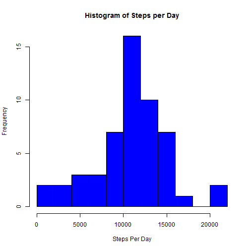
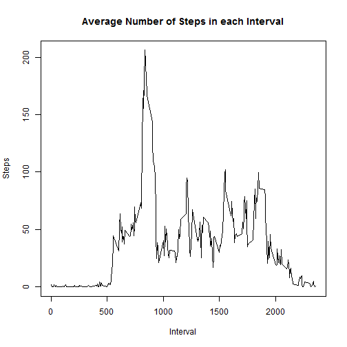
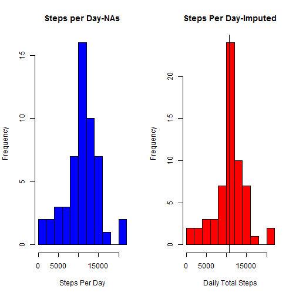
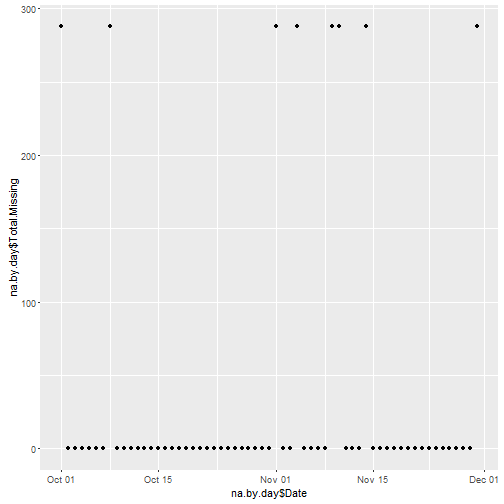
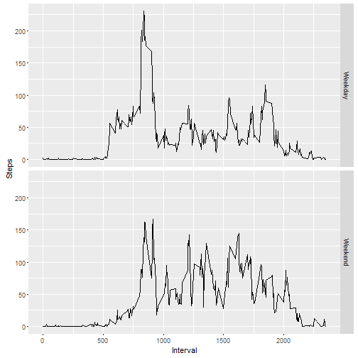

1. First we need to load the activity monitoring data.  The data file is available here:https://d396qusza40orc.cloudfront.net/repdata%2Fdata%2Factivity.zip.  The version we'll use was downloaded at 19:29 31 MAY 16. 


```r
amd<-read.csv("C:/Users/Larkin/Documents/Coursera Work/Reproducible Research/activity/activity.csv")
```


Now we need to get the dates and times in an easier format to manipulate.


```r
amd$date<-as.Date(amd$date, "%Y-%m-%d")
```

Now let's answer some questions: What is the mean total number of steps taken per day?

Aggregate the data by day:


```r
daily_steps<-aggregate(amd$steps, by = list(amd$date), sum)
names(daily_steps)<-c("Date","Total_Steps")
daily_steps
```

```
##          Date Total_Steps
## 1  2012-10-01          NA
## 2  2012-10-02         126
## 3  2012-10-03       11352
## 4  2012-10-04       12116
## 5  2012-10-05       13294
## 6  2012-10-06       15420
## 7  2012-10-07       11015
## 8  2012-10-08          NA
## 9  2012-10-09       12811
## 10 2012-10-10        9900
## 11 2012-10-11       10304
## 12 2012-10-12       17382
## 13 2012-10-13       12426
## 14 2012-10-14       15098
## 15 2012-10-15       10139
## 16 2012-10-16       15084
## 17 2012-10-17       13452
## 18 2012-10-18       10056
## 19 2012-10-19       11829
## 20 2012-10-20       10395
## 21 2012-10-21        8821
## 22 2012-10-22       13460
## 23 2012-10-23        8918
## 24 2012-10-24        8355
## 25 2012-10-25        2492
## 26 2012-10-26        6778
## 27 2012-10-27       10119
## 28 2012-10-28       11458
## 29 2012-10-29        5018
## 30 2012-10-30        9819
## 31 2012-10-31       15414
## 32 2012-11-01          NA
## 33 2012-11-02       10600
## 34 2012-11-03       10571
## 35 2012-11-04          NA
## 36 2012-11-05       10439
## 37 2012-11-06        8334
## 38 2012-11-07       12883
## 39 2012-11-08        3219
## 40 2012-11-09          NA
## 41 2012-11-10          NA
## 42 2012-11-11       12608
## 43 2012-11-12       10765
## 44 2012-11-13        7336
## 45 2012-11-14          NA
## 46 2012-11-15          41
## 47 2012-11-16        5441
## 48 2012-11-17       14339
## 49 2012-11-18       15110
## 50 2012-11-19        8841
## 51 2012-11-20        4472
## 52 2012-11-21       12787
## 53 2012-11-22       20427
## 54 2012-11-23       21194
## 55 2012-11-24       14478
## 56 2012-11-25       11834
## 57 2012-11-26       11162
## 58 2012-11-27       13646
## 59 2012-11-28       10183
## 60 2012-11-29        7047
## 61 2012-11-30          NA
```


2. Plot a histogram of total steps by day:


```r
hist(daily_steps$Total_Steps, col ="blue", main = "Histogram of Steps per Day", xlab="Steps Per Day", breaks = 10)
```

 

3. Calculate the mean and median:

```r
mean.raw<-mean(daily_steps$Total_Steps, na.rm = T)

median.raw<-median(daily_steps$Total_Steps, na.rm = T)

mean.raw
```

```
## [1] 10766.19
```

```r
median.raw
```

```
## [1] 10765
```

4. Find the daily activity pattern:

First lets plot out the average number of steps in each five minute interval to get a sense for the activity pattern.


```r
ai<-aggregate(amd$steps, by=list(amd$interval), mean, na.rm=TRUE)
names(ai)<-c("Interval","Average.Steps")

plot(ai$Interval,ai$Average.Steps,type = "l", xlab = "Interval",ylab = "Steps", main="Average Number of Steps in each Interval")
```

 

5. Then, lets find the interval with the highest average step count.


```r
maxi<-which.max(ai$Average.Steps)

ai[maxi,]
```

```
##     Interval Average.Steps
## 104      835      206.1698
```
So the inteveral with the highest average step count (206.1) is 835.

6.Impute missing values:

First we need to find the total number of rows with missing values:


```r
sum(is.na(amd$steps))
```

```
## [1] 2304
```

So there are 2304 rows with missing values.  Lets see what percentage of the dat set that is:

```r
mean(is.na(amd$steps))
```

```
## [1] 0.1311475
```

13% is kind of a lot-we'll impute (estimate) those values now.

6. As a rough estimate we'll assign each mising interval the mean for that 5 minute  interval across all days. To do this
we'll us plyr to create a new dataset amdi with imputed values in place of NAs. We'll check that the NAs have been replaced 
using is.na .

```r
library(plyr)
impute.mean<-function(x) replace(x, is.na(x), (mean(x, na.rm=TRUE)))

amdi<-ddply(amd, ~interval, transform, steps=impute.mean(steps))

sum(is.na(amdi))
```

```
## [1] 0
```


```r
dayavgi<-aggregate(amdi$steps, by=list(amdi$date), sum)

names(dayavgi)<-c("Date","Total.Steps")
```

7. Let's take a look with a histogram:


```r
par(mfrow=c(1,2))

hist(daily_steps$Total_Steps, col ="blue", main = "Steps per Day-NAs", xlab="Steps Per Day", breaks = 10)

abline(v=mean(daily_steps$Total_Steps))


hist(dayavgi$Total.Steps, xlab="Daily Total Steps", main="Steps Per Day-Imputed", col="red", breaks=10)

abline(v=mean(daily_steps$Total_Steps, na.rm = T))
```

 

8. Now let's find the new mean and median using the imputed data and compare it to the orginal mean and median:


```r
mean.imputed<-mean(dayavgi$Total.Steps)

median.imputed<-median(dayavgi$Total.Steps)

mean.imputed
```

```
## [1] 10766.19
```

```r
mean.raw
```

```
## [1] 10766.19
```

```r
median.imputed
```

```
## [1] 10766.19
```

```r
median.raw
```

```
## [1] 10765
```

For both the mean and the median the imputed values are higher than the values in the data set with the missing values.  By comparing the histograms of the raw and imputed data we see that the requecy of days with very few steps per dat drops dramatically.  This could be an indication that some days with few steps actually had many missing values decreasing their total.  When the interval means are imputed the total steps on those days naturally rise.  We also see an increase in the frequecy of step counts near the mean which makes since given that by adding the average interval count in place of mising values we make all days more similar to the mean.   

We can test this by checking the distribution of NAs across each day and plotting the result.

```r
library(ggplot2)
count_nas<-function(x) {return(sum(is.na(x)))}

na.by.day<-aggregate(amd$steps, list(amd$date), FUN = count_nas)

names(na.by.day)<-c("Date","Total.Missing")

qplot(na.by.day$Date, na.by.day$Total.Missing)
```

 


The NAs are highly concentrated in just 8 days-so adding in the means makes a big difference for those days.  

Now let's see if there are differences between weekdays and weekends:


```r
wkday<-function(x) if (x %in% c("Saturday","Sunday")) {return("Weekend")} else {return("Weekday")}
amdi$day.of.week<-weekdays(amdi$date)
amdi$wk<-factor(sapply(amdi$day.of.week, wkday))

avg.steps.by.wk<-aggregate(amdi$steps, by=list(amdi$interval, amdi$wk), mean)

names(avg.steps.by.wk)<-c("Interval","Wk","Steps")

g<-ggplot(avg.steps.by.wk, aes(x=Interval, y=Steps,))

g+geom_line()+facet_grid(Wk~.)
```

 
